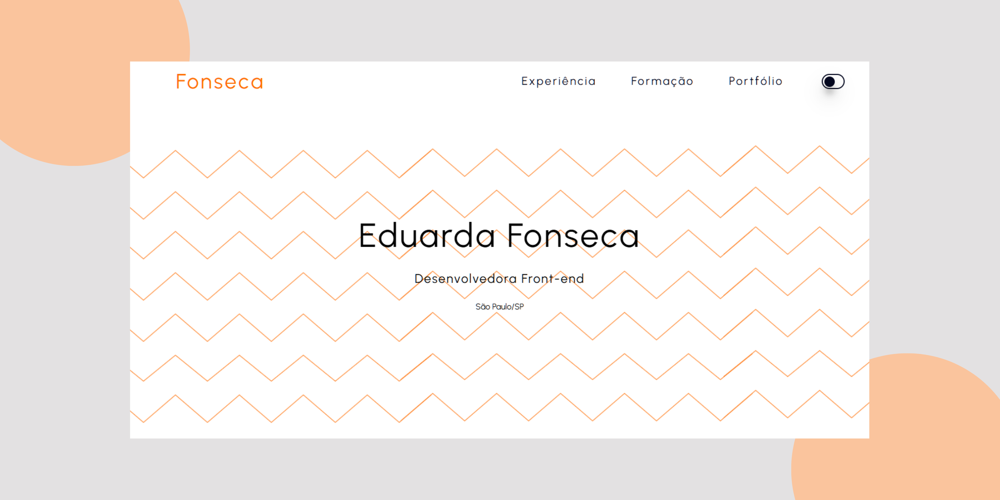

# Currículo 

Este é um currículo online criado com Vite + React + TypeScript. O objetivo é apresentar, de forma clara e interativa, as experiências profissionais, formação acadêmica e um link para o portfólio.

## 🛠️ Tecnologias Utilizadas

- Vite: Ferramenta de build moderna e rápida para projetos front-end.
- React: Biblioteca JavaScript para construção da interface de usuário.
- TypeScript: Superset do JavaScript que adiciona tipagem estática.
- SCSS (Sass): Extensão do CSS que permite o uso de variáveis, aninhamento e outras funcionalidades.
- HTML semântico (dentro do JSX) para estruturação das seções.
- Figma (mencionado no conteúdo) foi usado para criação do layout.

## ⚙️ Funcionalidades de destaque

- Scroll Listener: Exibe ou esconde o botão "voltar ao topo" dinamicamente.
- Dark Mode: Alternância de tema claro/escuro com classes CSS aplicadas ao <body>.
- Estilização avançada com SCSS: Utilização de aninhamento, variáveis e efeitos visuais em hover.

## 🔗 Links

   
   
  
   
     
    
   

